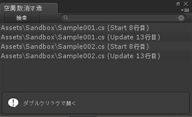
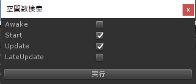

# EmptyFunctionMonitor
【Unity】空関数を見つけるツール

# 概要

空のStart()やUpdate()、使ってないのに残したままになっていませんか？ 
システムから呼ばれる関数は、存在するだけでパフォーマンスを食う罪作りな奴です。 
[公式マニュアルにも「空関数は消そう！」とあります。](https://unity3d.com/jp/learn/tutorials/topics/performance-optimization/optimizing-scripts-unity-games?playlist=44069) 
是非一掃したいですね！ 
そのお掃除をお手伝いします。

### ちなみに：そもそも新規作成時に作られるのが悪いんや！

[よろしい、ならばScriptTemplatesだ。](https://anchan828.github.io/editor-manual/web/scripttemplates.html)

# インストール

[パッケージはコチラ](./EmptyFunctionMonitor.unitypackage)

# 使い方

**MENU[Tools > EmptyFunctionMonitor]**

* ウィンドウの[検索]を押す
* 検索する関数を選択して＆実行 

* ウィンドウに検索結果が反映されるので、一つず潰していこう

Tips: 
* ダブルクリックで該当の箇所を開きます
* 一覧画面でDeleteを押すと項目を消せます

# License
The MIT License
